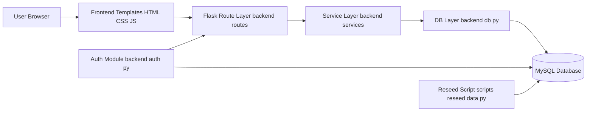
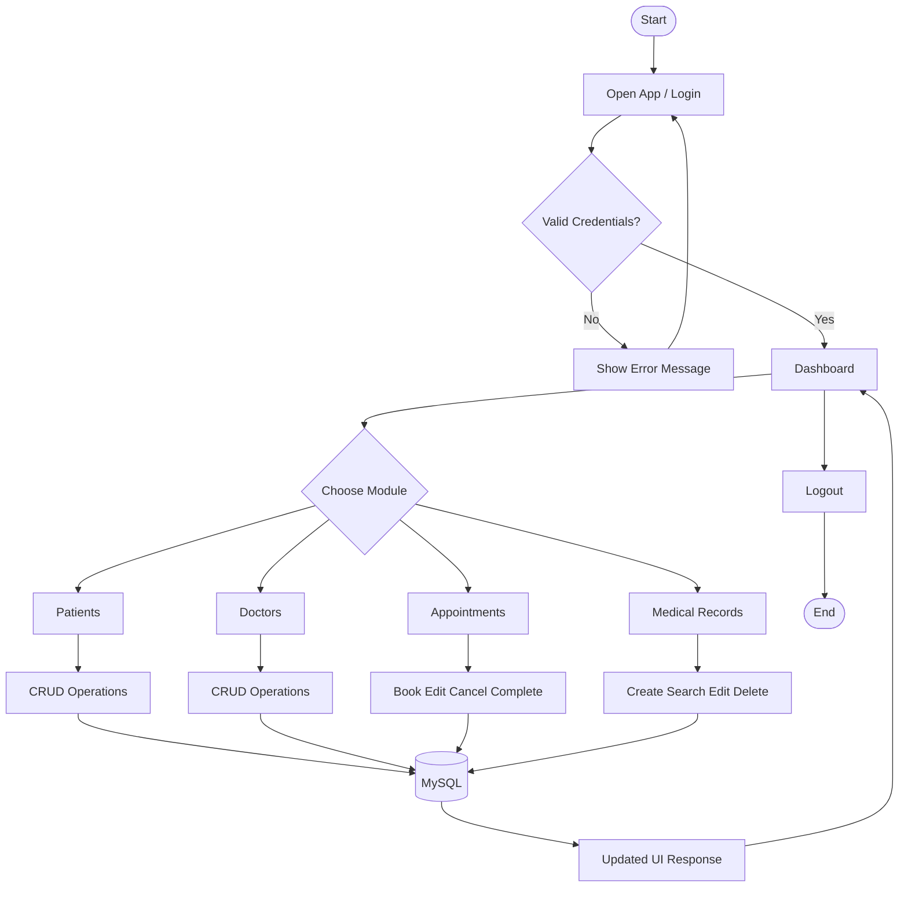
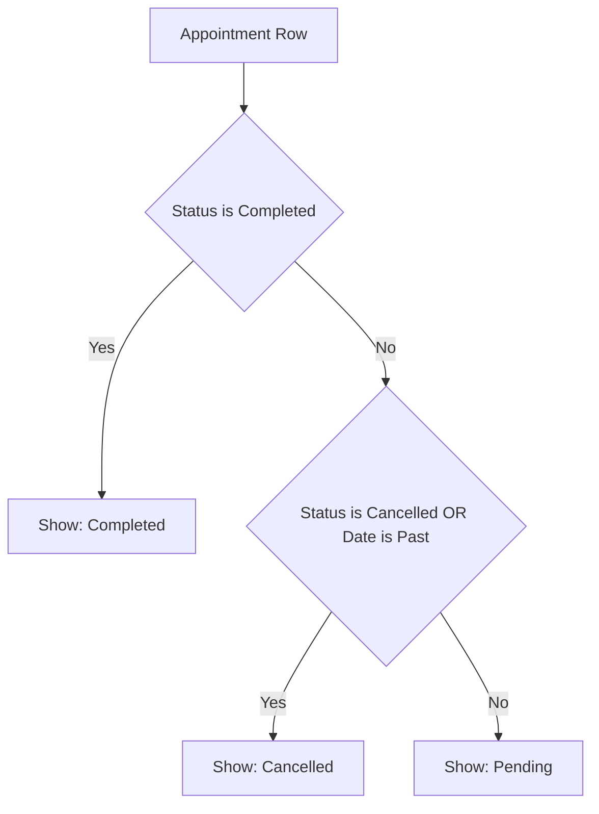

# Flowchart / Block Diagram - Patient Record System

## 1) High-Level Block Diagram

```mermaid
flowchart LR
    U[User Browser] --> V[Frontend Templates HTML CSS JS]
    V --> R[Flask Route Layer backend routes]
    R --> S[Service Layer backend services]
    S --> D[DB Layer backend db py]
    D --> M[(MySQL Database)]

    A[Auth Module backend auth py] --> R
    A --> M

    Z[Reseed Script scripts reseed data py] --> M
```

## 2) Application Flowchart

```mermaid
flowchart TD
    S0([Start]) --> S1[Open App / Login]
    S1 --> S2{Valid Credentials?}
    S2 -- No --> S3[Show Error Message]
    S3 --> S1
    S2 -- Yes --> S4[Dashboard]

    S4 --> S5{Choose Module}
    S5 --> P[Patients]
    S5 --> D[Doctors]
    S5 --> A[Appointments]
    S5 --> R[Medical Records]

    P --> C1[CRUD Operations]
    D --> C2[CRUD Operations]
    A --> C3[Book Edit Cancel Complete]
    R --> C4[Create Search Edit Delete]

    C1 --> DB[(MySQL)]
    C2 --> DB
    C3 --> DB
    C4 --> DB

    DB --> S6[Updated UI Response]
    S6 --> S4
    S4 --> S7[Logout]
    S7 --> E([End])
```

## 3) Appointment Status Logic (Current)

```mermaid
flowchart TD
    A0[Appointment Row] --> A1{Status is Completed}
    A1 -- Yes --> A2[Show: Completed]
    A1 -- No --> A3{Status is Cancelled OR Date is Past}
    A3 -- Yes --> A4[Show: Cancelled]
    A3 -- No --> A5[Show: Pending]
```
