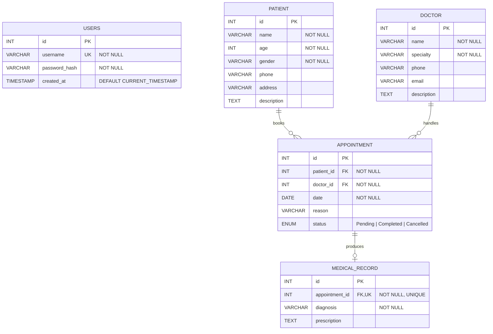

# ER Diagram - Patient Record System

This ERD is generated from the current MySQL schema in database/schema.sql.

## Cardinality Summary
- PATIENT (1) to APPOINTMENT (0..N)
- DOCTOR (1) to APPOINTMENT (0..N)
- APPOINTMENT (1) to MEDICAL_RECORD (0..1)
- USERS is currently independent (no FK relation in schema)

## Key Integrity Rules
- APPOINTMENT.patient_id references PATIENT.id with ON DELETE CASCADE
- APPOINTMENT.doctor_id references DOCTOR.id with ON DELETE CASCADE
- MEDICAL_RECORD.appointment_id references APPOINTMENT.id with ON DELETE CASCADE
- MEDICAL_RECORD.appointment_id is UNIQUE, enforcing at most one medical record per appointment
- USERS.username is UNIQUE

## Business Meaning
- If a patient is deleted, all linked appointments and their medical records are deleted automatically
- If a doctor is deleted, all linked appointments and their medical records are deleted automatically
- A medical record cannot exist without an appointment

## Validation Checklist
- All PKs are surrogate integer keys (AUTO_INCREMENT)
- All FK columns are NOT NULL where relationships are mandatory
- One-to-one behavior is correctly enforced through UNIQUE on MEDICAL_RECORD.appointment_id
- Status lifecycle for appointment is restricted by ENUM values
